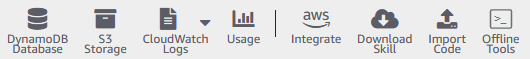

# Configure Alexa to send emails

## [Back to Table of Contents](./Table-of-Contents.md)

### User Story - Purpose of Component

- As a user I would like to recieve emails from Alexa with solutions to the code challenge I am working on.
- As a user I would like to recieve emails from Alexa with a list of daily job postings.

### Resources used in building this

When you are creating your Alexa skill you can choose to self host or to have it "Alexa Hosted". In this application we selected "Alexa Hosted", which means she provisions certain resources that are managed by default. These services are:
    - S3
    - DynamoDB
    - Lambda
    - Cloudwatch
  


When you go to the "Code" section in your Alexa developer console these skills will be listed at the top. All of these are available to you without any setup, with the caviat that you are granted a static role that has limited permissions. That is why to setup SES (or any other service), we need to do some setup. Check out the resource links below for the steps to allow Alexa to connect with your AWS account.

- [Linking other AWS resources](https://developer.amazon.com/en-US/docs/alexa/hosted-skills/alexa-hosted-skills-personal-aws.html)

You will also need to configure your SES to verify an email for sending.

- [Setting up SES](https://docs.aws.amazon.com/ses/latest/dg/Welcome.html)

- [A basic walkthrough for sending emails](https://pamphl3t.medium.com/send-a-email-from-your-alexa-with-aws-ses-176a81515680)

And you will need to enable permissions in the build tab of your developer console.


### Dependencies

All you need is the AWS-SDK (which Alexa should have installed by default)

## Relevant Code Snippets

You need to grant alexa permissions to read the user email. We did this by putting the string in an array, so more permissions could be added if needed.

```js
 const PERMISSIONS = ['alexa::profile:email:read']
 ```

This is how you grab a user's email from the account. Keep in mind they must enable it in the alexa app in the skill settings. [Here is an article that walks you through how to do this](https://www.c-sharpcorner.com/article/getting-an-email-address-in-an-alexa-skill2/).

```js

    const { serviceClientFactory, responseBuilder } = handlerInput

        try {
            //* fetching the user's email from the account
            const upsServiceClient = serviceClientFactory.getUpsServiceClient()
            const profileEmail = await upsServiceClient.getProfileEmail()
            //* if there is no profile with the associated account.
            if (!profileEmail) {
                const noEmailResponse = `It looks like you do not have an email set. You can set your email from the alexa companion app.`
                return responseBuilder.speak(noEmailResponse).getResponse()
            }
```

This is how Alexa assumes a temporary role that you set up in your IAMS following the "Linking other AWS resources" link. You will need this to utilize SES in any way.

```js
const sts = new aws.STS({ apiVersion: '2011-06-15' })

        const credentials = await sts
            .assumeRole(
                {
                    RoleArn: '<YOUR ALEXA ROLE ARN>',
                    RoleSessionName: 'SendEmailRoleSession'
                },
                (err, res) => {
                    if (err) {
                        console.log('AssumeRole FAILED: ', err)
                        throw new Error('Error while assuming role')
                    }
                    return res
                }
            )
            .promise()
```

Once you have permissions, you can use SES to send an email with the credentials you just made.

```js
    const ses = new aws.SES({
                apiVersion: '2010-12-01',
                region: 'us-east-2',
                accessKeyId: credentials.Credentials.AccessKeyId,
                secretAccessKey: credentials.Credentials.SecretAccessKey,
                sessionToken: credentials.Credentials.SessionToken
            })
```

___

### Known bugs/issues

None are known at the time of writing this. Make sure permissions are granted in your developer console. 
